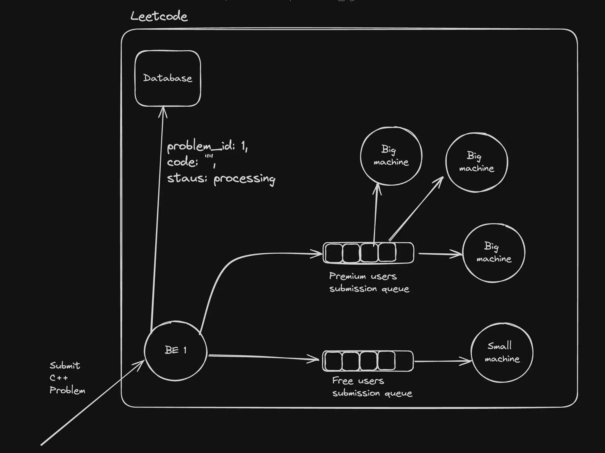

## ABEC : Advanced Backend Engineering Communications

Backend communication is a crucial aspect of distributed systems, ensuring efficient data flow, system scalability, and reliability. Let's explore some advanced backend communication techniques that are essential for modern backend systems.

## Types of communication
- Synchronous (Strong coupling)
HTTP (REST/GraphQL)
Websocket (debatable if sync or async)
 
- Asynchronous (Weak coupling)
Messaging queues
Pub subs
Server-Sent Events 
Websocket (debatable if sync or async)

## Websockets
> WebSockets provide a way to establish a persistent, full-duplex communication channel over a single TCP connection between the client (typically a web browser) and the server.
notion image
- Use Cases for WebSockets:
- Real-Time Applications: Chat applications, live sports updates, real-time gaming, and any application requiring instant updates can benefit from WebSockets.
- Live Feeds: Financial tickers, news feeds, and social media updates are examples where WebSockets can be used to push live data to users.
- Interactive Services: Collaborative editing tools, live customer support chat, and interactive webinars can use WebSockets to enhance user interactio

- Leetcode uses `polling` when you submit a problem ie sends requests again and again what happened with my answer.

