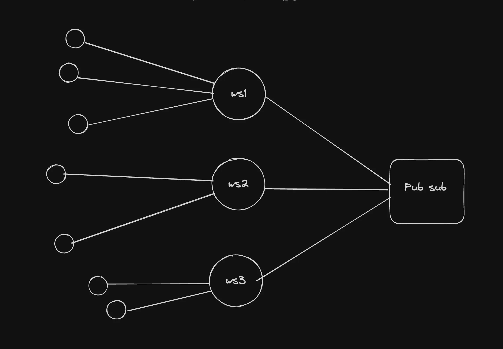
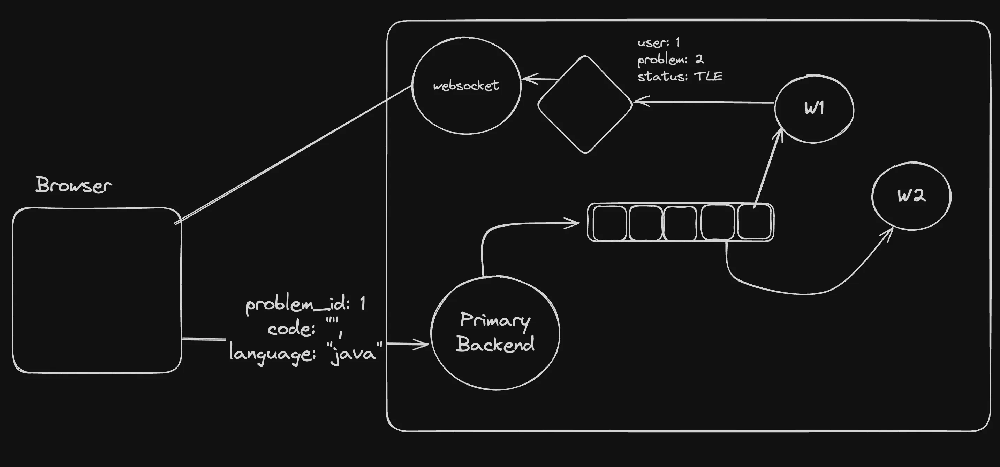

## ABEC : Advanced Backend Engineering Communications

Backend communication is a crucial aspect of distributed systems, ensuring efficient data flow, system scalability, and reliability. Let's explore some advanced backend communication techniques that are essential for modern backend systems.

## Types of communication
- Synchronous (Strong coupling)
HTTP (REST/GraphQL)
Websocket (debatable if sync or async)
 
- Asynchronous (Weak coupling)
Messaging queues
Pub subs
Server-Sent Events 
Websocket (debatable if sync or async)

## Websockets
> WebSockets provide a way to establish a persistent, full-duplex communication channel over a single TCP connection between the client (typically a web browser) and the server.
notion image
- Use Cases for WebSockets:
- Real-Time Applications: Chat applications, live sports updates, real-time gaming, and any application requiring instant updates can benefit from WebSockets.
- Live Feeds: Financial tickers, news feeds, and social media updates are examples where WebSockets can be used to push live data to users.
- Interactive Services: Collaborative editing tools, live customer support chat, and interactive webinars can use WebSockets to enhance user interactio

- Leetcode uses `polling` when you submit a problem ie sends requests again and again what happened with my answer.

> ws://localhost:8080/

## Scaling ws servers
- horizontal scaling .

## pubs , queues and redis 

- queues 

## REdis
- Redis is an open-source, `in-memory data structure` store, used as a database, cache, and message broker
One of the key features of Redis is its ability to keep all data in memory, which allows for high performance and low latency access to data. 

- RDB (Redis Database File): The RDB persistence performs point-in-time snapshots of your dataset at specified intervals. It creates a compact single-file representation of the entire Redis dataset. The snapshotting process can be configured to run at specified intervals, such as every X minutes if Y keys have changed.
- AOF (Append Only File): The AOF persistence logs every write operation received by the server, appending each operation to a file. This file can then be replayed on startup to reconstruct the dataset. 

### Starting redis locally
-  docker run --name my-redis -d -p 6379:6379 redis

- Connecting to your container
docker exec -it container_id /bin/bash

- Connecting to the redis cli
redis-cli
similar to psql cli or pg library or prisma in case of postgres.

## commands 

- SELECT <db_index>	Switches to a specific database (default is 0).
- FLUSHDB	Deletes all keys in the current database.
- FLUSHALL	Deletes all keys in all databases
- ping
- SET mykey "Hello" 

Getting data
- GET mykey

Deleting data
- DEL mykey
- EXPIRE key seconds
- TTL key
- HSET key field value	Sets a field in a hash.
- HGET key field	Retrieves the value of a field in a hash.
- HDEL key field	Deletes a field from a hash.

- queue : {
- LPUSH problems 1  
- RPOP problems 
}

- BRPOP problems 0 
block pop from problems till push happens for infinite time.